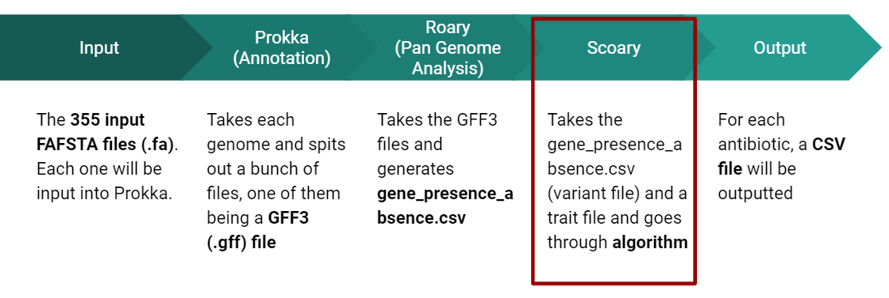

# Scoary on E. Coli data for GWAS Software Comparison
This repo contains scripts that take data output from Prokka and Roary (aka the software that needs linux/Ubuntu) that Scoary needs to run.
## Subheader

The main goal is to run analysis on Scoary on an E. Coli dataset (UCSC, Jay Kim, CRWN 89: Workshop in Computational Biology) and check against known causative genes for specific antibiotic resistance.

So .fa, .gff3, .csv

Citation:
Seemann T.
Prokka: rapid prokaryotic genome annotation
Bioinformatics 2014 Jul 15;30(14):2068-9.
PMID:24642063

Andrew J. Page, Carla A. Cummins, Martin Hunt, Vanessa K. Wong, Sandra Reuter, Matthew T. G. Holden, Maria Fookes, Daniel Falush, Jacqueline A. Keane, Julian Parkhill.
Roary: Rapid large-scale prokaryote pan genome analysis
Bioinformatics 2015 Jul 20. pii: btv421
PMID: 26198102
