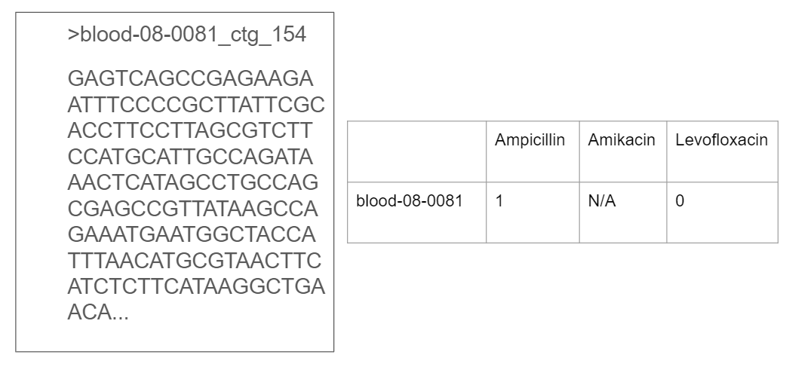

# Scoary on E. Coli data for GWAS Software Comparison
This repository contains scripts that prepare data (property of Jay Kim, UCSC for CRWN 89: Workshop in Computational Biology; not included in this public repository) for use by Scoary. Since Scoary needs two intermediate preprocessing steps to get from genome data (FAFSTA/.fa files) to a list of associations between genes and traits, these scripts can be referenced as an example implementation of the complete pipeline.

## Pipeline

Above pipeline was for my class project on the data provided for CRWN 89 which consisted of a large dataset of E. Coli specimens.

## Requirements
Roary requires a Linux or OSX operating system. See the Roary GitHub for installation requirements. I have a Windows machine, and I used their downloadable virtual machine image for smaller experiments, then switched to a Linux-based computing cluster for my entire dataset. 

To be able to run the pipeline, you will need FAFSTA (.fa) files with the genomes or contigs of particular specimens, and a binary traits file (.csv) with your phenotypes of interest that show whether or not a particular specimen is known to demonstrate that trait. N/A's are allowed if it is unknown. Make sure to only include traits with known causative genes.

On the left is an example of how a FAFSTA file looks like, and on the right is the corresponding row in the traits file for the particular speciment (blood-08-0081).

## Relevant files
* *prokka_script* - bash script that you run in the directory where your .fa files are located to run Prokka and extract the GFF3 files and put them in a subfolder called gff_files. See *./prokka_ec958* for example of full output files returned by Prokka on one specimen FAFSTA file. 
* *roary_job.slurm* - a Slurm job request for a computing cluster. Includes the command line prompt to run Roary. See *roary_output_try2* for example output files of Roary 
* *scoary_job.slurm* - a Slurm job request for a compting cluster. Calls *./scoary_csv/scoary_script* to run Scoary on the command prompt.  *./scoary_csv* contains the traits from the required trait input file separated so that each trait gets its own .csv file.

*The rest of the files are specific to my class project*

## Objective
The main goal is to run analysis on Scoary on an E. Coli dataset and check against known causative genes for specific antibiotic resistance, as seen in the pipeline above.

## Citations

### Scoary software
Brynildsrud O, Bohlin J, Scheffer L, Eldholm V. \
Rapid scoring of genes in microbial pan-genome-wide association studies with Scoary. \
Genome Biol. 2016;17:238 \
https://github.com/AdmiralenOla/Scoary

### Prokka software
Seemann T.\
Prokka: rapid prokaryotic genome annotation\
Bioinformatics 2014 Jul 15;30(14):2068-9.\
PMID:24642063\
https://github.com/tseemann/prokka

### Roary software
Andrew J. Page, Carla A. Cummins, Martin Hunt, Vanessa K. Wong, Sandra Reuter, Matthew T. G. Holden, Maria Fookes, Daniel Falush, Jacqueline A. Keane, Julian Parkhill.\
Roary: Rapid large-scale prokaryote pan genome analysis\
Bioinformatics 2015 Jul 20. pii: btv421\
PMID: 26198102 \
https://sanger-pathogens.github.io/Roary/

## Helpful links
* https://github.com/microgenomics/tutorials/blob/master/pangenome.md
